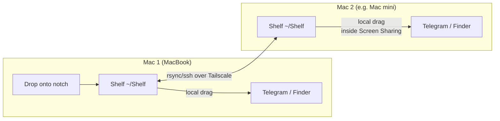

# Chelka

**A file shelf in your MacBook's notch — with optional sync to a second Mac over Tailscale.**

Русская версия: [README.ru.md](README.ru.md)

Drag a file onto the notch — it lands on a "shelf". From there, drag it out
into Telegram, Finder, or anywhere else at any time. If a remote peer is
configured, a copy of the file automatically flies to your second Mac and
appears on the same shelf there — so files effectively "drag and drop"
between machines, even on different networks.

## How it works

Drag-and-drop on macOS is a single-machine mechanism: you can't drag a file
between computers with the cursor, or through a Screen Sharing window. So the
shelf lives **on both sides**, and the `~/Shelf` folder is synced between them:



- The shelf is a transparent panel over the notch (`NSPanel`, never steals
  focus). On screens without a notch (Mac mini, external displays) it's a
  slim strip at the top-center of the screen.
- Receiving and giving away drags is always local, so it works natively.
- Transfer to the peer: `rsync` over `ssh` using the Tailscale hostname.
  Tailscale provides encryption and authentication; rsync resumes big files.
- The app on the second machine watches `~/Shelf` and shows new files
  on its shelf instantly.
- Images, PDFs and videos show as content thumbnails (QuickLook).

Design details and rejected alternatives:
[ADR-0001](docs/architecture/decisions/ADR-0001-notch-shelf-sync.md) (in Russian).

## Requirements

- macOS 13+ on Apple Silicon.
- Swift 6 toolchain — Command Line Tools are enough (`xcode-select --install`),
  full Xcode is **not** required.
- For two-machine sync: [Tailscale](https://tailscale.com) on both Macs and
  Remote Login (sshd) enabled on the receiving one.

---

## Install: single Mac

The shelf works standalone — drop files on the notch, pull them out later.

```bash
git clone <repo-url> chelka && cd chelka
make test      # run self-checks (35 assertions)
make install   # build + install to /Applications + launch
```

That's it. Hover the notch — the shelf slides out.

- **Relaunch after quitting**: Spotlight (⌘Space) → "Chelka".
- **Start at login**: right-click the expanded shelf → "Запускать при входе"
  (Launch at login).
- **Update after pulling new code**: `make install` again.

## Install: two Macs over Tailscale

Scenario: you drop a file on Mac 1 (the MacBook) and it appears on the shelf
of Mac 2 (say, a Mac mini you use over Screen Sharing). The machines only
need to share a tailnet — same Wi-Fi is not required.

Placeholders below: `<peer>` is Mac 2's Tailscale hostname
(see `tailscale status`), e.g. `my-mac-mini` or `my-mac-mini.tailXXXX.ts.net`.

### 1. On Mac 2 (receiving)

1. Install and run the app (see single-Mac steps above).
2. Install Tailscale and sign in to your tailnet.
3. Enable **Remote Login**: System Settings → General → Sharing → Remote Login,
   allow your user.

### 2. On Mac 1 (sending)

Install the app the same way, then set up a dedicated SSH key — **without a
passphrase** (the transport runs in `BatchMode` and can't type one):

```bash
ssh-keygen -t ed25519 -N "" -f ~/.ssh/id_chelka -C "chelka-transport"
ssh-copy-id -i ~/.ssh/id_chelka.pub <peer>       # asks Mac 2's password once
printf '\nHost <peer>\n  IdentityFile ~/.ssh/id_chelka\n  IdentitiesOnly yes\n' >> ~/.ssh/config
ssh -o BatchMode=yes <peer> 'echo ok'            # must print: ok
```

Point the app at the peer and restart it:

```bash
defaults write dev.mike.Chelka peerHost <peer>
pkill -x Chelka; open /Applications/Chelka.app
```

Done: files dropped on Mac 1's notch now appear on Mac 2's shelf within
seconds. Delivery status shows as a dot on the file's icon:
🟠 uploading · 🟢 delivered · 🔴 failed (5 retries exhausted — right-click →
resend after fixing the network).

### 3. Make it bidirectional (optional but recommended)

Steps 1–2 set up Mac 1 → Mac 2 only. To also send files Mac 2 → Mac 1
(drop something on Mac 2's shelf — e.g. inside a Screen Sharing session —
and pick it up on Mac 1), mirror the same setup in the other direction:

1. **On Mac 1**: enable Remote Login (System Settings → General → Sharing).
2. **On Mac 2** (`<mac1>` is Mac 1's Tailscale hostname):

   ```bash
   ssh-keygen -t ed25519 -N "" -f ~/.ssh/id_chelka -C "chelka-transport"
   ssh-copy-id -i ~/.ssh/id_chelka.pub <mac1>
   printf '\nHost <mac1>\n  IdentityFile ~/.ssh/id_chelka\n  IdentitiesOnly yes\n' >> ~/.ssh/config
   ssh -o BatchMode=yes <mac1> 'echo ok'          # must print: ok
   defaults write dev.mike.Chelka peerHost <mac1>
   pkill -x Chelka; open /Applications/Chelka.app
   ```

Now anything dropped on either shelf appears on both machines.
No sync loops can occur: the app only pushes files **dropped on that
machine** — files that arrived from the peer are displayed, never re-sent.
A file dropped before `peerHost` was configured can be sent later:
right-click it → "Send to the other machine".

### 4. Lock down the transport key (recommended)

By default an SSH key grants full shell access. Restrict the transport key
so it can do exactly one thing — receive files into `~/Shelf`. On the
**sending** machine, from the cloned repo:

```bash
scp scripts/chelka-receive.sh <peer>:.chelka-receive
ssh <peer> 'chmod +x .chelka-receive; grep -q "restrict.*chelka-transport" .ssh/authorized_keys || sed -i "" -e "/chelka-transport/s|^ssh-ed25519|restrict,command=\"$HOME/.chelka-receive\" ssh-ed25519|" .ssh/authorized_keys'
```

Verify: shell must now be refused, transport must still work:

```bash
ssh -o BatchMode=yes <peer> 'id' || echo "shell blocked — good"
ssh -o BatchMode=yes <peer> 'mkdir -p Shelf' && echo "transport ok"
```

(The `echo ok` test from step 2 will fail after this — that's the point.
For a bidirectional setup, repeat on the other machine.)

> **Why a dedicated key?** Default `ssh-copy-id` picks whatever key it finds,
> and keys with non-standard filenames aren't offered by ssh at all — you end
> up with "password works, key doesn't". A dedicated passphrase-less key plus
> `IdentitiesOnly yes` avoids that whole class of problems.

> **Copying the built .app to another Mac?** Use `rsync`/`scp`. AirDrop sets
> the quarantine flag and Gatekeeper will block the ad-hoc signature
> (fixable with `xattr -dr com.apple.quarantine /Applications/Chelka.app`).

## Usage

| Action | How |
|---|---|
| Shelve a file | drag it onto the notch (the shelf opens by itself) |
| Take a file | hover the notch → drag the file out |
| Remove from shelf | right-click the file → remove (goes to Trash) |
| Reveal in Finder | right-click the file |
| Send / resend to the peer | right-click the file → "Send to the other machine" |
| Launch at login | right-click the shelf background |
| Quit | right-click the shelf background |

## Development

```bash
make build    # debug build (swift build)
make test     # self-checks (swift run chelka-selftest)
make app      # assemble build/Chelka.app
make run      # build and run from build/
make install  # build, install to /Applications, relaunch
```

```
Sources/
├─ ChelkaCore/        # pure logic, no AppKit — covered by tests
│  ├─ Naming.swift        # unique file names on collisions
│  └─ ShelfGeometry.swift # panel geometry, animation progress
├─ Chelka/            # the app
│  ├─ AppDelegate.swift   # panel, screens, frame animation
│  ├─ ShelfPanel.swift    # NSPanel above the notch
│  ├─ ShelfView.swift     # drop target + drag source + drawing
│  ├─ ShelfStore.swift    # ~/Shelf folder + watcher
│  ├─ ThumbnailCache.swift# QuickLook previews
│  └─ Transport.swift     # rsync/ssh push with retries
└─ chelka-selftest/   # executable tests (XCTest needs full Xcode)
```

More docs (mostly in Russian) live in [docs/](docs/index.md).

## Troubleshooting

App logs:

```bash
log show --last 30m --predicate 'eventMessage CONTAINS "Chelka"' --style compact | tail -20
```

| Symptom | Cause / fix |
|---|---|
| 🔴 dot, log says `Permission denied (publickey,...)` | the key isn't being offered — verify `ssh -o BatchMode=yes <peer> 'echo ok'`; see "Why a dedicated key" |
| No dots on icons at all | `peerHost` not set: `defaults read dev.mike.Chelka peerHost` |
| Peer hostname doesn't resolve | MagicDNS disabled in your tailnet — use the peer's `100.x.x.x` Tailscale IP as `peerHost` |
| Network fixed, file still not sent | the app stops after 5 retries: right-click → resend |
| Gatekeeper blocks the app on the second Mac | the .app was moved via AirDrop (quarantine) — see note above |
| Can't find the shelf on a Mac without a notch | look for a translucent strip at the top-center of the screen |

## Security model

Both machines are assumed to belong to **the same person**. Defense in depth
on top of that assumption:

- `peerHost` is validated before reaching ssh/rsync — option/shell injection
  is rejected (17 tests).
- The transport key is locked to a forced command (setup step 4): it can only
  receive files into `~/Shelf` — no shell, no reads, no other paths (10 tests).
- Host keys are pinned: the app runs with `StrictHostKeyChecking=yes`; the
  one-time pinning happens interactively at `ssh-copy-id`.
- Received files get `com.apple.quarantine` from the receiving app, so
  executables from the shelf go through Gatekeeper like any download.
- Transfers never overwrite existing files on the receiver
  (`--ignore-existing`); the app deletes only to the Trash.

Full audit — threat model, findings, verification — lives in
[docs/security/index.md](docs/security/index.md) (in Russian).

## Known limitations

- Sandbox is off (the app spawns ssh/rsync) — so no Mac App Store.
- Push-only sync: removing a file from one shelf does not remove it from the other.
- No scrolling: the shelf shows as many files as fit its width.
- Folders transfer, but appear on the receiver before their contents finish
  copying (rsync's atomic rename covers single files only).

## License

[MIT](LICENSE)
