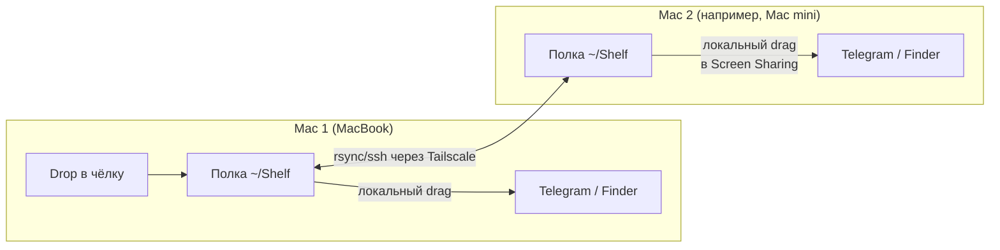

# Chelka

<p align="center"></p>

**Полка для файлов в чёлке MacBook — с синхронизацией на второй Mac через Tailscale.**

English version: [README.md](README.md)

Перетаскиваешь файл на чёлку — он ложится на «полку». Оттуда его можно в любой
момент вытащить drag'ом в Telegram, Finder или куда угодно. Если настроен
удалённый пир, копия файла автоматически улетает на второй Mac и появляется
в такой же полке там — так файлы «перетаскиваются» между компьютерами,
даже когда они в разных сетях.

## Как это работает

Drag-and-drop в macOS — механизм одной машины: перетащить файл курсором между
компьютерами или сквозь окно Screen Sharing нельзя. Поэтому полка стоит **с двух
сторон**, а между ними синхронизируется папка `~/Shelf`:



- Полка — прозрачная панель поверх чёлки (`NSPanel`, не перехватывает фокус).
  На экране без чёлки (Mac mini, внешний монитор) — полоска по центру верхней кромки.
- Приём и отдача drag'а всегда локальные, поэтому работают нативно.
- Отправка на пир: `rsync` поверх `ssh` по Tailscale-имени. Шифрование и
  аутентификацию даёт Tailscale, докачку больших файлов — rsync.
- Приложение на второй машине следит за `~/Shelf` и мгновенно показывает
  новые файлы у себя на полке.
- Картинки, PDF и видео показываются миниатюрами содержимого (QuickLook).

Подробности решения — в [ADR-0001](docs/architecture/decisions/ADR-0001-notch-shelf-sync.md).

## Требования

- macOS 13+ на Apple Silicon.
- Swift 6 — достаточно Command Line Tools (`xcode-select --install`),
  полный Xcode **не нужен**.
- Для синхронизации двух машин: [Tailscale](https://tailscale.com) на обеих
  и включённый Remote Login (sshd) на принимающей.

---

## Установка: один Mac

Полка полноценно работает сама по себе — задропил на чёлку, вытащил когда нужно.

```bash
git clone <repo-url> chelka && cd chelka
make test      # самопроверки
make install   # сборка + установка в /Applications + запуск
```

Готово. Наведи курсор на чёлку — полка выедет.

- **Перезапуск после выхода**: Spotlight (⌘Space) → «Chelka».
- **Автозапуск**: правая кнопка по раскрытой полке → «Запускать при входе».
- **Обновление после `git pull`**: снова `make install`.

## Установка: два Mac через Tailscale

Сценарий: дропаешь файл на Mac 1 (MacBook) — он появляется на полке Mac 2
(например, Mac mini, которым пользуешься через Screen Sharing). Машинам
достаточно одного tailnet — общий Wi-Fi не нужен.

Плейсхолдер ниже: `<peer>` — Tailscale-имя Mac 2 (см. `tailscale status`),
например `my-mac-mini` или `my-mac-mini.tailXXXX.ts.net`.

### 1. На Mac 2 (принимающем)

1. Установить и запустить приложение (как в разделе «один Mac»).
2. Установить Tailscale, войти в свой tailnet.
3. Включить **Remote Login**: Настройки → Основные → Общий доступ → Remote
   Login, разрешить своему пользователю.

### 2. На Mac 1 (отправляющем)

Установить приложение так же, затем завести выделенный ssh-ключ —
обязательно **без passphrase** (транспорт работает в `BatchMode` и ввести
её не сможет):

```bash
ssh-keygen -t ed25519 -N "" -f ~/.ssh/id_chelka -C "chelka-transport"
ssh-copy-id -i ~/.ssh/id_chelka.pub <peer>       # спросит пароль Mac 2 один раз
printf '\nHost <peer>\n  IdentityFile ~/.ssh/id_chelka\n  IdentitiesOnly yes\n' >> ~/.ssh/config
ssh -o BatchMode=yes <peer> 'echo ok'            # должно напечатать: ok
```

Указать приложению пира и перезапустить:

```bash
defaults write dev.mike.Chelka peerHost <peer>
pkill -x Chelka; open /Applications/Chelka.app
```

Готово: файлы с чёлки Mac 1 появляются на полке Mac 2 за секунды. Статус
доставки — точка на иконке: 🟠 отправляется · 🟢 доставлено · 🔴 не удалось
(5 попыток исчерпаны — после починки сети правая кнопка → отправить ещё раз).

### 3. В обе стороны (опционально, но рекомендуется)

Шаги 1–2 настраивают только Mac 1 → Mac 2. Чтобы файлы ездили и обратно
(дропнул на полку Mac 2 — например, внутри Screen Sharing — забрал на Mac 1),
зеркально повтори настройку в другую сторону:

1. **На Mac 1**: включить Remote Login (Настройки → Основные → Общий доступ).
2. **На Mac 2** (`<mac1>` — Tailscale-имя Mac 1):

   ```bash
   ssh-keygen -t ed25519 -N "" -f ~/.ssh/id_chelka -C "chelka-transport"
   ssh-copy-id -i ~/.ssh/id_chelka.pub <mac1>
   printf '\nHost <mac1>\n  IdentityFile ~/.ssh/id_chelka\n  IdentitiesOnly yes\n' >> ~/.ssh/config
   ssh -o BatchMode=yes <mac1> 'echo ok'          # должно напечатать: ok
   defaults write dev.mike.Chelka peerHost <mac1>
   pkill -x Chelka; open /Applications/Chelka.app
   ```

Теперь всё, что дропнуто на любую из полок, появляется на обеих машинах.
Петля синхронизации невозможна: приложение отправляет только файлы,
**задропленные на этой машине**, — прилетевшие от пира лишь показываются
и повторно не пересылаются. Файл, задропленный до настройки `peerHost`,
можно дослать потом: правая кнопка → «Отправить на вторую машину».

### 4. Зажать транспортный ключ (рекомендуется)

Обычный ssh-ключ даёт полный shell. Ограничь транспортный ключ так, чтобы он
умел ровно одно — принимать файлы в `~/Shelf`. На **отправляющей** машине,
из клонированного репозитория:

```bash
scp scripts/chelka-receive.sh <peer>:.chelka-receive
ssh <peer> 'chmod +x .chelka-receive; grep -q "restrict.*chelka-transport" .ssh/authorized_keys || sed -i "" -e "/chelka-transport/s|^ssh-ed25519|restrict,command=\"$HOME/.chelka-receive\" ssh-ed25519|" .ssh/authorized_keys'
```

Проверка: shell должен отклоняться, транспорт — работать:

```bash
ssh -o BatchMode=yes <peer> 'id' || echo "shell заблокирован — так и надо"
ssh -o BatchMode=yes <peer> 'mkdir -p Shelf' && echo "транспорт работает"
```

(Тест `echo ok` из шага 2 после этого перестанет проходить — в этом и смысл.
Для двусторонней связки повтори на второй машине.)

> **Почему выделенный ключ?** `ssh-copy-id` без `-i` копирует первый
> попавшийся ключ, а ключи с нестандартными именами файлов ssh вообще не
> предъявляет — получается «пароль проходит, ключ нет». Отдельный ключ без
> passphrase плюс `IdentitiesOnly yes` снимает весь класс проблем.

> **Переносите собранный .app на другой Mac?** Только `rsync`/`scp`: AirDrop
> ставит карантин, и Gatekeeper заблокирует ad-hoc подпись (лечится
> `xattr -dr com.apple.quarantine /Applications/Chelka.app`).

## Использование

| Действие | Как |
|---|---|
| Положить файл | перетащить на чёлку (полка раскроется сама) |
| Достать файл | навести курсор на чёлку → drag файла куда нужно |
| Убрать с полки | правая кнопка по файлу → «Убрать с полки» (в Корзину) |
| Показать в Finder | правая кнопка по файлу |
| Отправить/дослать на пира | правая кнопка по файлу → «Отправить на вторую машину» |
| Автозапуск | правая кнопка по фону полки → «Запускать при входе» |
| Выйти | правая кнопка по фону полки → «Завершить Chelka» |

## Разработка

```bash
make build    # отладочная сборка
make test     # самопроверки
make app      # собрать build/Chelka.app
make run      # собрать и запустить из build/
make install  # собрать, поставить в /Applications, перезапустить
make deploy   # install + залить сборку на вторую машину (PEER=<host>)
```

Структура исходников и остальная документация — в [README.md](README.md#development)
и [docs/](docs/index.md).

## MCP-сервер для ИИ-агентов

В бандле приложения едет MCP-сервер: агенты (Claude Code, Codex, любой
MCP-клиент) работают с полкой напрямую, без shell-команд:

| Инструмент | Что делает |
|---|---|
| `shelf_list` | список файлов на полке |
| `shelf_grab` | забрать файл с полки в каталог (`keep:false` — перенос) |
| `shelf_put` | положить файл на полку; `send:true` — и отправить на пира |
| `shelf_remove` | убрать файл с полки в Корзину |

Регистрация один раз после `make install`:

```bash
# Claude Code (внутри этого репозитория .mcp.json подхватится сам)
claude mcp add chelka /Applications/Chelka.app/Contents/MacOS/chelka-mcp -s user
```

```toml
# Codex (~/.codex/config.toml)
[mcp_servers.chelka]
command = "/Applications/Chelka.app/Contents/MacOS/chelka-mcp"
```

`shelf_put` с `send:true` использует тот же защищённый транспорт, что и
приложение (валидация peerHost, BatchMode, запиненные host key,
`--ignore-existing`); имена файлов проверяются от path traversal.

## Отладка

Логи приложения:

```bash
log show --last 30m --predicate 'eventMessage CONTAINS "Chelka"' --style compact | tail -20
```

Таблица «симптом → лечение» — в [английском README](README.md#troubleshooting).

## Модель безопасности

Предполагается, что обе машины принадлежат **одному человеку**. Поверх этого
допущения — защита в глубину:

- `peerHost` валидируется до попадания в ssh/rsync — инъекция опций и
  shell-конструкций отклоняется (17 тестов).
- Транспортный ключ зажат forced command (шаг 4 установки): умеет только
  принимать файлы в `~/Shelf` — ни shell, ни чтения, ни других путей (10 тестов).
- Host key запиннен: приложение работает со `StrictHostKeyChecking=yes`,
  разовый пиннинг — интерактивно на `ssh-copy-id`.
- Прилетевшие файлы получают `com.apple.quarantine` от принимающего
  приложения — исполняемое с полки проходит Gatekeeper как любая загрузка.
- Передача никогда не перезаписывает существующие файлы на приёмнике
  (`--ignore-existing`); приложение удаляет только в Корзину.

Полный аудит — модель угроз, находки, проверки — в
[docs/security/index.md](docs/security/index.md).

## Ограничения (осознанные)

- Sandbox выключен (приложение запускает ssh/rsync) — значит, мимо Mac App Store.
- Push-only: удаление с полки не синхронизируется на другую машину.
- Полка без скролла — видно столько файлов, сколько влезает по ширине.
- Папки передаются, но появляются на приёмнике до окончания докачки содержимого.

## Лицензия

[MIT](LICENSE)
